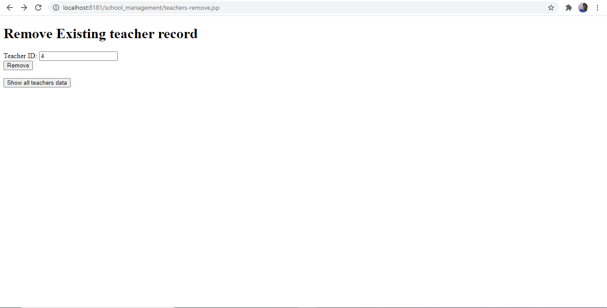
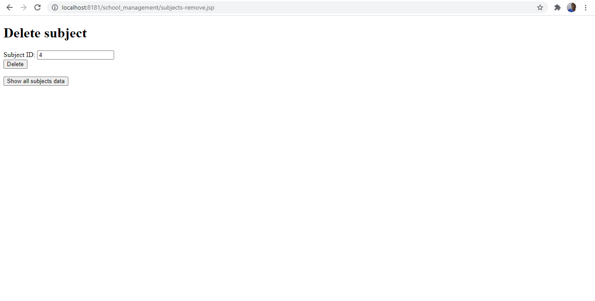

# School-Management
Learner's Academy is a School Management Application to maintain records of teachers, students, classes, subject via an administrative login
<h1>Project Overview</h1>
<pre>
Learner's Academy is an Application implementing data maintaining features and 4 operations for all 4 tables (teacher, student, clas, subject)

1) Insert new record
2) Update existing record
3) Delete record
4) Show all records
</pre>
<h1>Project Github Repository url</h1>
https://github.com/devadeepdeb/School-Management
<h1>Output</h1>
<h3>Code to display the welcome screen. It should display:</h3>
<h2>Output 1</h2>

Main application window: Application name and the developer details

Admin Login link

<h2>Output 2</h2>

Admin login form and click on Submit button

<h2>Output 3</h2>

Acceptance of admin credentials and Option to go to Reports

Option for Managing Report of School with these details:

Option to Manage Teachers

Option to Manage Subjects

Option to Manage Classes

Option to Manage Students

Mapping of Teachers, Subjects, Classes, Subjects

<h2>Output 4</h2>

Choices of Managing Teachers

1) Insert new record by checking the table

2) Update existing record by checking the table

3) Delete record by checking the table

4) Show all records by checking the table

<h2>Output 5</h2>

Teachers 4 operations with validation

Records will be added/updated/deleted on the basis of primary key and uniqueness of values. Updation/Deletion will be based on Teacher_ID (tid).

There are two Teacher Columns: Teacher_ID (tid) and Teacher_Name (tname).

<h2>Output 6</h2>

Subjects 4 operations with validation

Records will be added/updated/deleted on the basis of primary key and uniqueness of values. Updation/Deletion will be based on Subject_ID (sid).

There are two Subject Columns: Subject_ID (tid) and Subject_Name (tname).

<h2>Output 7</h2>

Classes 4 operations with validation

Records will be added/updated/deleted on the basis of primary key and uniqueness of values. Updation/Deletion will be based on Class_ID (cid).

There are two Class Columns: Class_ID (cid) and Class_Name (cname).

<h2>Output 8</h2>

Students 4 operations with validation

Records will be added/updated/deleted on the basis of primary key and uniqueness of values. Updation/Deletion will be based on Student_ID (stid).

There are two Student Columns: Student_ID (stid) and Student_Name (stname).

<h2>Output 9</h2>

Assignments 4 operations with validation for mapping of Teachers, Subjects, Classes, Students

Records will be added/updated/deleted on the basis of primary key and uniqueness of values. Updation/Deletion will be based on Student_ID (stid).

There are two Student Columns: Student_ID (stid) and Student_Name (stname).

<h1>Database is schooldb. Used phpMyAdmin for mysql to create database and table</h1>

Used 6 tables in that database:

1) teacher (tid - primary, tname - unique) for teachers

2) subject (sid - primary, sname - unique) for subjects

3) clas (cid - primary, cname - unique) for class

4) student (sid - primary, sname - unique) for student

5) assignment (tid - foreign key referencing to teacher table, cid - foreign key referencing to class table and unique, sid - foreign key referencing to subject table, stid - foreign key referencing to student table and unique) for assignment

6) login (username, password) for admin

<h1>Application Algorithm</h1>
<pre>
1) Start.
2) Welcome Screen to Print Application, Developer Name and admin link to login.
3) Admin logins and get the 5 options to manage - teacher, subject, class, student, login and assignment (for mapping).
4) For each of these 5 options, there are 4 sub-options to add, update, delete and show records.
5) Enter values in sub-options except show records.
5a) If correct values entered, success message and return to 5) and continue.
5b) If incorrect values entered, re-enter/failure message and return to 5) and continue.
6) See tables of each 5 options. 
7) End
</pre>
<h1>Application Flowchart</h1>

<h1>Agile Framework</h1>

I have used Agile Scrum Methodology to deliver this Application taking 2 Sprints, considering 1 Sprint per week.

In first week, I have installed Apache Tomcat 9.0 for server, phpMyadmin for mysql and worked to prepare Servlet files 

In second week, I have created JSP files with modifications, integrations and compilations to test final application in localhost via server localhost for delivery and then pushed source code to GitHub via Git Bash with documentation.

<h1>Core Concepts</h1>

IDE : Eclipse Oxygen

Command Line Emulator Used: Git Bash 2.28.0 version

Git repository hosting service: GitHub

Operating System: Windows 10

Java Compiler Version: 1.8

Java Concepts Used: Exception, If-else, Class, Function, Packages, JSP, Servlet, Maven

Web Server: Apache Tomcat 9.0

Mysql database administration tool: phpMyAdmin

<h1>Data Structures</h1>

Sequential Search: In this, the list or array  (here a list of files) is traversed sequentially and every element is checked. In this application Linear Searching is used to search data in tables.

<h1>Conclusion</h1>

Application can be enhanced further by adding images and more formatting styles
