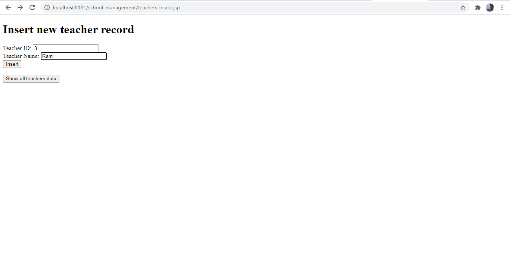
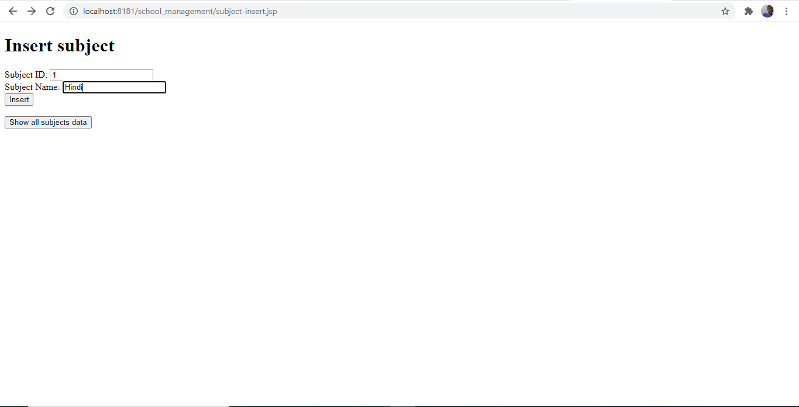

# School-Management
Learner's Academy is a School Management Application to maintain records of teachers, students, classes, subject via an administrative login
<h1>Project Overview</h1>
<pre>
Learner's Academy is an Application implementing data maintaining features and 4 operations for all 4 tables (teacher, student, clas, subject)

1) Insert new record
2) Update existing record
3) Delete record
4) Show all records
</pre>
<h1>Project Github Repository url</h1>
https://github.com/devadeepdeb/School-Management
<h1>Output</h1>
<h3>Code to display the welcome screen. It should display:</h3>
<h2>Output 1</h2>

Main application window: Application name and the developer details

Admin Login link

<h2>Output 2</h2>

Admin login form and click on Submit button

<h2>Output 3</h2>

Acceptance of admin credentials and Option to go to Reports

Option for Managing Report of School with these details:

Option to Manage Teachers

Option to Manage Subjects

Option to Manage Classes

Option to Manage Students

Mapping of Teachers, Subjects, Classes, Subjects

<h2>Output 4</h2>

Choices of Managing Teachers

1) Insert new record by checking the table

2) Update existing record by checking the table

3) Delete record by checking the table

4) Show all records by checking the table

<h2>Output 5</h2>

Teachers 4 operations with validation

Records will be added/updated/deleted on the basis of primary key and uniqueness of values. Updation/Deletion will be based on Teacher_ID (tid).

There are two Teacher Columns: Teacher_ID (tid) and Teacher_Name (tname).

<h2>Output 6</h2>

Subjects 4 operations with validation

Records will be added/updated/deleted on the basis of primary key and uniqueness of values. Updation/Deletion will be based on Subject_ID (sid).

There are two Subject Columns: Subject_ID (tid) and Subject_Name (tname).

<h2>Output 7</h2>

Classes 4 operations with validation

Records will be added/updated/deleted on the basis of primary key and uniqueness of values. Updation/Deletion will be based on Class_ID (cid).

There are two Class Columns: Class_ID (cid) and Class_Name (cname).

<h2>Output 8</h2>

Students 4 operations with validation

Records will be added/updated/deleted on the basis of primary key and uniqueness of values. Updation/Deletion will be based on Student_ID (stid).

There are two Student Columns: Student_ID (stid) and Student_Name (stname).

<h2>Output 8</h2>

Assignments 4 operations with validation for mapping of Teachers, Subjects, Classes, Students

Records will be added/updated/deleted on the basis of primary key and uniqueness of values. Updation/Deletion will be based on Student_ID (stid).

There are two Student Columns: Student_ID (stid) and Student_Name (stname).
